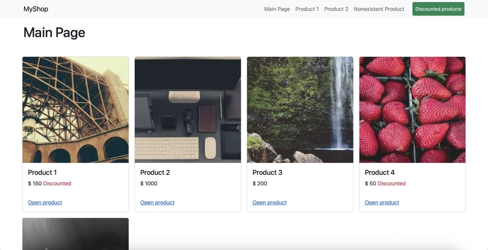

# Základy Angularu - Cvičení 4 - Routing v e-shopu

Aplikace MyShop se skládá z následujících stránek:
1. Seznam produktů

2. Produktová stránka

3. Stránka "nenalezeno"

Soubor `db.json` lze použít ke spuštění mock backend serveru https://www.npmjs.com/package/json-server.

Příkaz: `json-server --watch db.json`.

# Dílčí práce k provedení

## 1. Umistěte `router-outlet` na vhodné místo.Zadeklarujte strukturu routingu.

Zadeklarujte strukturu routingu tak, aby:
1. Seznam produktů měl vlastní routu
2. Každý produkt určený svým produktovým ID měl vlastní URL
* Nápověda: toto lze realizovat pomocí path parametrů
3. Indexová routa vedla na seznam produktů
4. Wildcard routa vedla na stránku "nenalezeno"

*Připomínáme, že cesty v definicích rout NEsmí začínat lomítkem.*

## 2. Na produktovou stránku naimplementujte získávání path parametru produktového ID a na základě získaného produktového ID načtěte data produktu z backendu.

Backend operace je implementována v `ApiProductsService.getProductById`.

*Nezapomeňte, že každý `subscribe` na `Observable` vyžaduje `unsubscribe` v `ngOnDestroy`.*

*Zkuste ošetřit stav, kdy uživatel zadá produktové ID, které v databázi neodpovídá žádnému produktu. Nápověda: error observer.*

## 3. Na seznam produktů naimplementujte podporu pro filtrování dle zlevněných produktů. Toto filtrování nechť se děje tehdy, když je při routingu předán query parametr `discounted=true`.

Filtr na zlevněné produkty lze nastavit pomocí parametru `discounted` v `ApiProductsService.getAllProducts(discounted?: boolean)`.

## 4. Do horního panelu aplikace doimplementujte přechody na routy:
* "Main Page" nechť odkazuje na indexovou routu
* "Product 1" nechť odkazuje na produktovou stránku - produkt s ID=1
* "Product 2" nechť odkazuje na produktovou stránku - produkt s ID=2
* "Nonexistent Product" nechť odkazuje na produktovou stránku - produkt s ID, které neexistuje (např. 6000)
* Tlačítko "Discounted products" nechť otevře seznam produktů se zafiltrovanými zlevněnými produkty

**Záměrně na lekci nebyl předveden routing s query parametry. Zkuste na základě hledání v dokumentaci Angularu nebo na Googlu najít, jak se routuje s query parametry a nalezené řešení aplikujte.**

## 5. Na seznam produktů implementujte do linku "Open product" přechod na produktovou stránku na produkt s daným ID
